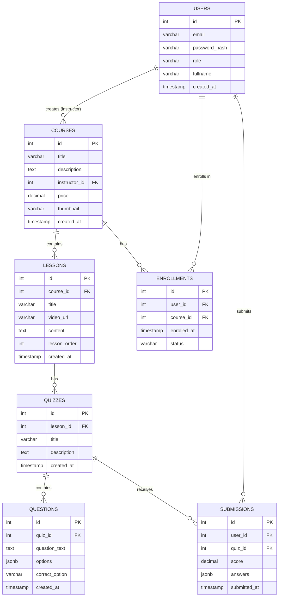

# Sơ đồ thực thể liên kết (ERD) - LMS

```mermaid
erDiagram
    USERS {
        int id PK
        varchar email
        varchar password_hash
        varchar role
        varchar fullname
        timestamp created_at
    }
    
    COURSES {
        int id PK
        varchar title
        text description
        int instructor_id FK
        decimal price
        varchar thumbnail
        timestamp created_at
    }
    
    LESSONS {
        int id PK
        int course_id FK
        varchar title
        varchar video_url
        text content
        int lesson_order
        timestamp created_at
    }
    
    QUIZZES {
        int id PK
        int lesson_id FK
        varchar title
        text description
        timestamp created_at
    }
    
    QUESTIONS {
        int id PK
        int quiz_id FK
        text question_text
        jsonb options
        varchar correct_option
        timestamp created_at
    }
    
    ENROLLMENTS {
        int id PK
        int user_id FK
        int course_id FK
        timestamp enrolled_at
        varchar status
    }
    
    SUBMISSIONS {
        int id PK
        int user_id FK
        int quiz_id FK
        decimal score
        jsonb answers
        timestamp submitted_at
    }

    USERS ||--o{ COURSES : "creates (instructor)"
    USERS ||--o{ ENROLLMENTS : "enrolls in"
    USERS ||--o{ SUBMISSIONS : "submits"
    
    COURSES ||--o{ LESSONS : "contains"
    COURSES ||--o{ ENROLLMENTS : "has"
    
    LESSONS ||--o{ QUIZZES : "has"
    
    QUIZZES ||--o{ QUESTIONS : "contains"
    QUIZZES ||--o{ SUBMISSIONS : "receives"
```
